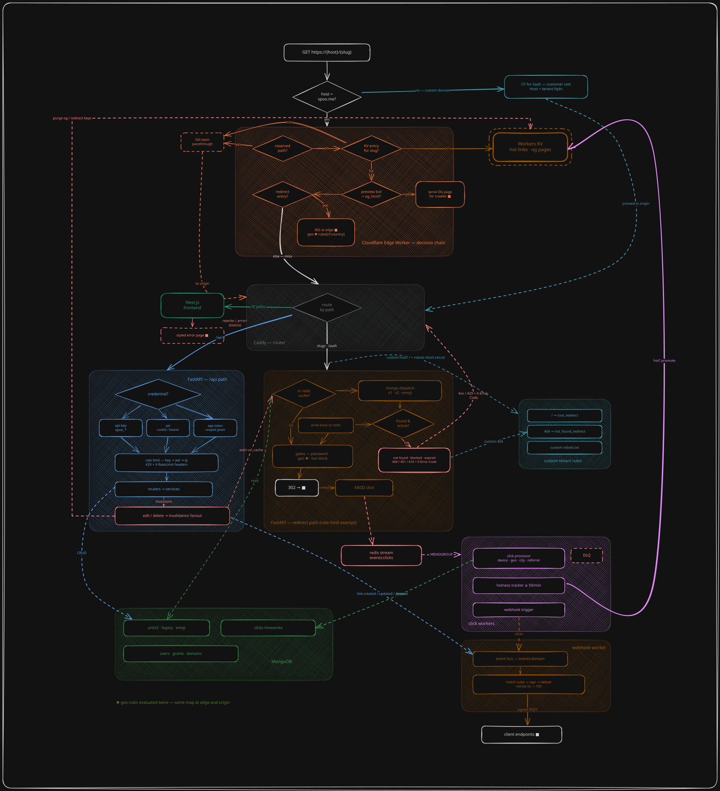

<p align="center">
  <a href="https://spoo.me">
    <picture>
      <source media="(prefers-color-scheme: dark)" srcset="https://spoo.me/brand/logo-text-dark.png">
      
    </picture>
  </a>
</p>

<p align="center">
  Open-source link management. Short links, click analytics, and an API.
</p>

<p align="center">
  <a href="https://spoo.me"><kbd>🌐 Website</kbd></a>
  <a href="https://spoo.me/docs/introduction"><kbd>📖 Docs</kbd></a>
  <a href="https://spoo.me/docs/self-hosting/introduction"><kbd>🏠 Self-hosting</kbd></a>
  <a href="https://github.com/spoo-me/frontend"><kbd>🖥️ Frontend</kbd></a>
  <a href="https://spoo.me/discord"><kbd>💬 Discord</kbd></a>
</p>

<p align="center">
  
  
  <a href="https://status.spoo.me"></a>
  <a href="https://spoo.me/discord"></a>
  <a href="https://twitter.com/spoo_me"></a>
  <a href="https://codecov.io/gh/spoo-me/spoo"></a>
</p>

<p align="center">
  <a href="https://spoo.me"></a>
</p>

## ⚡ About

spoo.me has shortened over 10 million links and redirected over 150 million clicks. This repository is the backend that serves them: the redirect path, the analytics pipeline, the public API, accounts and auth, and the abuse and safety systems that keep a public shortener usable.

The backend is FastAPI on MongoDB and Redis, with a Cloudflare Worker in front for the busiest links. The web app lives in [spoo-me/frontend](https://github.com/spoo-me/frontend). Everything here can be self-hosted, and every external service it talks to is optional.

## 🔥 What it does

### 🔗 Links

- **Custom aliases**, including emoji aliases (`spoo.me/🚀🔥`)
- **Password protection, click limits, and expiry dates** on any link
- **Bot blocking** per link
- **Tags** for organising links
- **Bulk actions** to create, update, and delete many links at once
- **Claim links**: shorten without an account, then attach the links to one later
- **Custom domains**, with your own root redirect, 404 page, and robots.txt [![self-host][self-host]](#-self-hosting)
- **Geo targeting**: a different destination for each visitor country [![self-host][self-host]](#-self-hosting)
- **A/B splits** across several destinations, with stats per variant [![self-host][self-host]](#-self-hosting)
- **Scheduled links** that go live at a set time, with an optional page before launch [![self-host][self-host]](#-self-hosting)
- **Expired-link fallback**: a destination for when a link expires or hits its click limit [![self-host][self-host]](#-self-hosting)
- **Custom link previews**: the title, description, and image social apps show [![self-host][self-host]](#-self-hosting)

### 📊 Analytics

- **Clicks and unique clicks** over time, in any timezone
- **Breakdowns** by country, city, browser, OS, device, referrer, and UTM tags
- **Combined dimensions** in one query (`group_by=time,country,browser`), with filters on each
- **Bot traffic** detected and counted separately from human traffic
- **Public stats pages** at `spoo.me/stats/<alias>`, or private stats per link
- **Exports** as CSV, XLSX, JSON, or XML

### ⌨️ Developer platform

- **REST API** at `/api/v1`, versioned, with a published [OpenAPI spec](openapi.json)
- **API keys** with scopes and per-key rate limits
- **OAuth 2.0 device flow** with PKCE, so CLIs, bots, and apps can sign users in
- **Signed webhooks** for clicks and link changes, with retries [![self-host][self-host]](#-self-hosting)
- **Official SDKs** in five languages, [listed below](#-ecosystem)

## 🏗️ Architecture

<p align="center">
  <a href=".github/assets/architecture.svg"></a>
  <br><sub>Click the diagram to open it full size.</sub>
</p>

- **Redirects.** The app resolves an alias through a two-tier cache before it touches MongoDB. Links that cross a click threshold get promoted to Workers KV, and the Worker serves them from the Cloudflare edge without reaching the origin.
- **Clicks.** A redirect writes a click event to a Redis stream and returns. A separate worker consumes the stream to record stats, promote hot links, and run safety analysis, so a slow database never slows a redirect.
- **Degrades instead of failing.** If the queue Redis is down, clicks are recorded inline. If the cache Redis is down, reads go to MongoDB. Without Cloudflare credentials the origin serves everything. A self-hosted instance needs MongoDB and Redis and nothing else.
- **Layered code.** Requests go `routes` to `services` to `repositories` to MongoDB, with dependencies wired in one place (`dependencies/wiring.py`).

## 🧩 Ecosystem

Everything below is built on the public API. The web app is [spoo-me/frontend](https://github.com/spoo-me/frontend), and the docs source is [spoo-me/docs](https://github.com/spoo-me/docs).

### 📦 SDKs

<table>
  <tr>
    <td width="50%" align="center"><a href="https://github.com/spoo-me/spoo-ts"></a><br>TypeScript</td>
    <td width="50%" align="center"><a href="https://github.com/spoo-me/spoo-py"></a><br>Python</td>
  </tr>
  <tr>
    <td width='50%' align='center'><code>npm install spoo.me</code></td>
    <td width='50%' align='center'><code>pip install spoo</code></td>
  </tr>
  <tr>
    <td width="50%" align="center"><a href="https://github.com/spoo-me/spoo-go"></a><br>Go</td>
    <td width="50%" align="center"><a href="https://github.com/spoo-me/spoo-rust"></a><br>Rust</td>
  </tr>
  <tr>
    <td width='50%' align='center'><code>go get github.com/spoo-me/spoo-go</code></td>
    <td width='50%' align='center'><code>cargo add spoo-me</code></td>
  </tr>
  <tr>
    <td width="50%" align="center"><a href="https://github.com/spoo-me/spoo-kotlin"></a><br>Kotlin</td>
    <td width="50%"></td>
  </tr>
  <tr>
    <td width='50%' align='center'><code>me.spoo:spoo</code></td>
    <td width="50%"></td>
  </tr>
</table>

### 📱 Client apps

<table>
  <tr>
    <td width="50%" align="center"><a href="https://github.com/spoo-me/spoo-cli"></a><br>CLI</td>
    <td width="50%" align="center"><a href="https://github.com/spoo-me/spoo-android"></a><br>Android</td>
  </tr>
  <tr>
    <td width='50%' align='center'><code>brew install spoo-me/tap/spoo</code></td>
    <td width='50%' align='center'><a href="https://github.com/spoo-me/spoo-android/releases/latest">GitHub releases</a></td>
  </tr>
  <tr>
    <td width="50%" align="center"><a href="https://github.com/spoo-me/spoo-raycast"></a><br>Raycast</td>
    <td width="50%" align="center"><a href="https://github.com/spoo-me/spoo-bot"></a><br>Discord bot</td>
  </tr>
  <tr>
    <td width='50%' align='center'><a href="https://github.com/spoo-me/spoo-raycast">From source</a></td>
    <td width='50%' align='center'><a href="https://github.com/spoo-me/spoo-bot">From source</a></td>
  </tr>
</table>

## 🛡️ Safety

A public shortener attracts phishing. spoo.me checks a destination more than once over a link's life, and each check can hand off to a deeper one.

### ⏱️ When a link gets checked

| Moment | What happens |
|---|---|
| Created or edited | Every create and every destination edit passes the gate before it is saved. Changing a link's destination later is a common bait-and-switch, so an edit always qualifies for the deep check. |
| Created in a burst | Counters on link creation flag a destination domain that suddenly gets a lot of new links. |
| Goes viral | A link that crosses the click threshold is screened at that moment if nobody has judged its destination yet. This catches campaigns seeded quietly and spread after every creation check has passed. |
| Hidden behind a wrapper | Links through share wrappers like `t.co` and `lnkd.in` are followed hop by hop, and the page they land on is what gets judged. |
| Reported | The public report form feeds the same pipeline, with its own daily budget for deep checks. |
| After the fact | When a threat feed lists a new domain, existing links to it are found through an index and blocked in the same sync. Every hour, a sweep screens each destination host created in the last 48 hours that has no verdict yet. |

### 🔍 How deep each check goes

1. **Gate.** Runs on every create and edit against blocklists, threat feeds, and destinations already judged harmful.
2. **Screening.** Runs in the background and adds Google Web Risk. Anything it can't judge goes to a person, never straight to "safe".
3. **Investigation.** Renders the page in an isolated browser, follows every redirect, and checks the domain's records before deciding how far a block should reach.

### 🚫 What a block does

- A block can cover a whole host, one path, or single links, so a phishing page on `sites.google.com` doesn't take down the platform.
- Blocked links return `451` from the next click, at the origin and the edge, and new links to the same destination are refused.
- A person's call always overrides an automated one, and every block can be reversed.

## 🌍 Using the hosted service

Every short link works the same way.

| URL | What you get |
|---|---|
| `spoo.me/<alias>` | Redirects to the destination. [spoo.me/ga](https://spoo.me/ga) |
| `spoo.me/<alias>+` | Shows where the link goes without following it. [spoo.me/ga+](https://spoo.me/ga+) |
| `spoo.me/stats/<alias>` | Public stats for the link. [spoo.me/stats/ga](https://spoo.me/stats/ga) |

Password-protected links open a password page. Pass `?password=<password>` to skip it.

To shorten from code, see the [API reference](https://spoo.me/docs/introduction) or pick an SDK above.

## 🏠 Self-hosting

The full guide, including every environment variable, is at [spoo.me/docs/self-hosting](https://spoo.me/docs/self-hosting/introduction). The short version, with Docker:

```bash
git clone https://github.com/spoo-me/spoo.git
cd spoo
cp .env.example .env    # set SECRET_KEY and the JWT_* values
docker compose up -d
```

That starts MongoDB, Redis, and the app on `http://localhost:8000`. OAuth providers, email, Sentry, hCaptcha, and Cloudflare are all optional and switch off cleanly when their variables are empty.

Features marked ![self-host][self-host] are built and tested but switched off by default. Turn one on for everyone with a document in the `feature_flags` collection:

```js
db.feature_flags.insertOne({ name: "geo_targeting", enabled: true, rollout_type: "everyone" })
```

The flag names are `custom_domains`, `geo_targeting`, `ab_testing`, `link_scheduling`, `expired_fallback`, `custom_meta_tags`, and `webhooks`. Webhooks also need `WEBHOOKS_ENABLED=true`, and custom domains need `CUSTOM_DOMAINS_ENABLED=true` plus a Cloudflare for SaaS zone (`CUSTOM_DOMAINS_CF_*`).

To run without Docker, you need Python 3.10+, [uv](https://docs.astral.sh/uv/), and a MongoDB and Redis you can reach:

```bash
uv sync
uv run main.py
```

## 🛠️ Development

```bash
make dev             # run the app with reload
make test            # full test suite with coverage
make test-unit       # unit tests only
make lint            # ruff check
make format-check    # ruff format --check
make docker-up       # full stack: MongoDB, Redis, app
make openapi         # regenerate openapi.json after changing routes or schemas
```

Both `make lint` and `make format-check` must pass before a pull request can merge.

## 🤝 Contributing

Bug reports and pull requests are welcome. Read the [contributing guide](.github/CONTRIBUTING.md) first, and [open an issue](https://github.com/spoo-me/spoo/issues/new) before starting on anything large.

To report a security issue, follow [SECURITY.md](.github/SECURITY.md) instead of opening a public issue. For anything else, email [support@spoo.me](mailto:support@spoo.me) or ask on [Discord](https://spoo.me/discord).

---

<h6 align="center">

<br>
© spoo.me . 2026

All Rights Reserved</h6>

<p align="center">
 <a href="https://github.com/spoo-me/spoo/blob/main/LICENSE"></a>
</p>

[self-host]: https://img.shields.io/badge/self--host-30363d?style=flat-square
